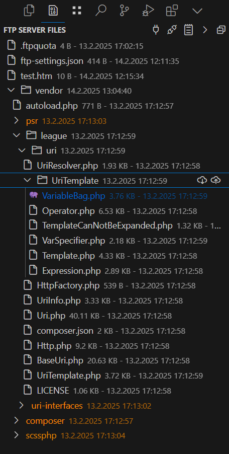

<<<<<<< HEAD
# Alfs FTP Plugin - VS Code FTP Extension

A user-friendly FTP plugin for Visual Studio Code that provides seamless FTP integration with visual feedback and automatic synchronization features.



## Key Features

- 🚀 One-click connection with auto-connect option
- 📂 Easy file and folder upload/download with progress indication
- 🎨 Visual status indicators:
  - Blue: Files that are newer locally
  - Orange: Files that exist only on the server
- ⏱️ Automatic timestamp synchronization
- 🔄 Bi-directional synchronization
- 🔍 Integrated debug view
- 📱 Clean and intuitive UI
- 🖱️ Double-click to open files directly
- 📊 Progress bars for all operations

## Getting Started

1. Create an `ftp-settings.json` in your project root:
```json
{
    "host": "ftp.example.com",
    "user": "username",
    "password": "password",
    "port": 21,
    "secure": false,
    "root": "/",
    "name": "FTP Server",
    "ignoreCertificateErrors": true,
    "rejectUnauthorized": false,
    "showFileActions": true,
    "compareTimestamps": true,
    "ui": {
        "newerLocalColor": "#0066cc",
        "showIcons": true
=======
# Alfs FTP Plugin for VS Code

A user-friendly FTP plugin for Visual Studio Code that enables easy file upload and download via FTP.


## Features

### File Operations
- 📤 Upload files via FTP
- 📥 Download files from FTP server
- 📂 Synchronize folder structure
- 🆕 Create new files and folders directly on the server
- 🔄 Automatic detection of newer local files

### Automation
- ⚡ Automatic upload on save (optional)
- 🖱️ Automatic actions on click (configurable):
  - Upload newer files
  - Download server files
- 💾 Timestamp synchronization between local and server files

### User Interface
- 🌳 FTP Explorer in sidebar
- 🎨 Color highlighting for newer local files
- 📊 Various display modes:
  - Timestamp
  - File size
  - Names only

### Security
- 🔒 Support for secure FTP connections (FTPS)
- ⚙️ Configuration via separate JSON file
- 🔑 Secure credential storage

## Installation

1. Open VS Code
2. Open Extensions view (`Ctrl+Shift+X`)
3. Search for "Alfs FTP Plugin"
4. Click "Install"

## Configuration

### 1. Via ftp-settings.json (recommended)

Create an `ftp-settings.json` in your project's root directory:

```json
{
    "host": "ftp.your-domain.com",
    "username": "your_username",
    "password": "your_password",
    "remoteDirectory": "/public_html",
    "secure": false,
    "display": {
        "mode": "timestamp"
    },
    "autoActions": {
        "uploadOnClick": true,
        "downloadOnClick": true
>>>>>>> 030dc8ff48000dbbbaa73b5f61eaf08715963d53
    }
}
```

<<<<<<< HEAD
### Configuration Options

* `host`: FTP server hostname
* `user`: Username for authentication
* `password`: Password for authentication
* `port`: FTP port (default: 21)
* `secure`: Use FTPS (default: false)
* `root`: Root directory on server (default: "/")
* `name`: Display name for the connection
* `ignoreCertificateErrors`: Ignore SSL certificate errors
* `rejectUnauthorized`: Reject unauthorized SSL certificates
* `showFileActions`: Show upload/download icons
* `compareTimestamps`: Enable timestamp comparison
* `ui.newerLocalColor`: Color for newer local files
* `ui.showIcons`: Show file type icons

2. Open the FTP Explorer view in the sidebar
3. Click the connect button or wait for auto-connect
4. Start working with your files!

## Features in Detail

### Visual File Status
- **Blue files**: Indicate local changes that need to be uploaded
- **Orange files**: Show server-only files that aren't downloaded yet
- **Normal files**: In sync between local and server

### File Operations
- **Upload**: Click the upload icon next to any local file
- **Download**: Click the download icon next to any server file
- **Open**: Double-click any file to open it in the editor
- **Bulk Operations**: Upload/download entire folders with progress tracking

### Navigation
- **Expand/Collapse All**: Toggle all folders with one click
- **Auto-refresh**: View updates automatically after operations
- **Debug Log**: Quick access to operation details

## Extension Settings

This extension contributes the following settings:

* `alfsftpplugin.autoConnect`: Enable/disable automatic connection on startup
* `alfsftpplugin.defaultPort`: Set the default FTP port (default: 21)

## Requirements

- Visual Studio Code 1.87.0 or newer
- Active FTP server connection
- Basic FTP server credentials

## Known Issues

Please report issues on our [GitHub repository](https://github.com/AlfMueller/ftp-plugin-vscode/issues)

## Release Notes

### 0.0.1
- Initial release
- Basic FTP functionality
- Visual file status indicators
- Auto-connect feature
- Timestamp synchronization
- Debug view
- Folder expansion toggle

## Contributing

Found a bug or have a feature request? Please open an issue on our GitHub repository.

## License

This extension is licensed under the MIT License.

---

**Enjoy seamless FTP integration with Alfs FTP Plugin!**
=======
### 2. Via VS Code Settings
Use the "FTP: Configure Settings" command in the Command Palette (`Ctrl+Shift+P`).

## Usage

### FTP Explorer
- 👁️ Open the FTP view in the sidebar
- 📂 Navigate through server structure
- 🔍 View timestamps and file sizes
- 🔄 Refresh view with the refresh button

### Uploading Files
- 📤 Via context menu in Explorer
- ⌨️ Using keyboard shortcut `Ctrl+Alt+U`
- 💾 Automatically on save (if enabled)
- 🖱️ By clicking the upload arrow on newer files

### Downloading Files
- 📥 Via Command Palette (`Ctrl+Shift+P` → "FTP: Download File")
- ⌨️ Using keyboard shortcut `Ctrl+Alt+D`
- 🖱️ By clicking the download arrow in FTP view

### Creating New Items
- 📄 New File: Click "New File" in FTP view
- 📁 New Folder: Click "New Folder" in FTP view
- 📝 Files automatically open in editor

## Keyboard Shortcuts
- `Ctrl+Alt+U` - Upload file
- `Ctrl+Alt+D` - Download file
- `Ctrl+Alt+C` - Configure FTP settings

## Detailed Documentation
For detailed configuration instructions, see [FTP-SETTINGS-README.md](FTP-SETTINGS-README.md).

## Security Notes
- ⚠️ Don't store sensitive data in version control
- 🚫 Add `ftp-settings.json` to your `.gitignore`
- 🔒 Use FTPS when possible
- 👤 Use an FTP user with minimal required permissions

## Troubleshooting
If you encounter issues:
1. Check the debug output in VS Code
2. Consult the [FTP-SETTINGS-README.md](FTP-SETTINGS-README.md)
3. Create an issue in the GitHub repository

## License
MIT

## Developer
- AlfMueller
- [GitHub](https://github.com/AlfMueller/ftp-plugin-vscode)
>>>>>>> 030dc8ff48000dbbbaa73b5f61eaf08715963d53
